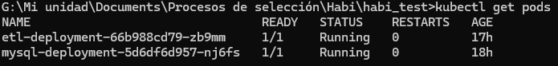

# Proyecto ETL - Habi Test

## Descripción
Este proyecto implementa un pipeline ETL (Extracción, Transformación y Carga) utilizando Apache Beam, MySQL y Docker/Kubernetes. El objetivo es procesar un archivo XML con información de usuarios y propiedades, cargar los datos en una base de datos MySQL y responder preguntas de negocio.

---

## Requisitos previos

### Softwares instalados:
- **Docker Desktop**: Para contenedores y orquestación.
- **Kubernetes**: Orquestador de contenedores.
- **Python 3.9+**: Para pruebas locales.

### Archivos del proyecto:
- **`sources/`**:
  - `feed.xml`: Archivo de datos fuente.
- **`kubernetes/`**:
  - `mysql-deployment.yaml`: Despliegue para MySQL en Kubernetes.
  - `etl-deployment.yaml`: Despliegue para el pipeline ETL en Kubernetes.
  - `mysql-service.yaml`: Despliegue de la configuración del servicio para MySQL.
- `create_schema_tables.py`: Script para crear el esquema y las tablas en MySQL.
- `db_connectors.py`: Maneja la conexión a la base de datos.
- `pipeline_beam.py`: Define el pipeline ETL.
- **`Dockerfile`**: Define la imagen Docker para el pipeline.
- **`docker-compose.yml`**: Orquesta los servicios para ejecución local.
- **`requirements.txt`**: Dependencias necesarias para el proyecto.

---

## Pasos de ejecución aplicados para la problemática

### 1. **Ejecución en local con Docker Compose**
1. Clona el repositorio:
   ```bash
   git clone https://github.com/davidprieto94/habi_test.git
   cd habi_test
   ```

2. Construye las imágenes Docker:
   ```bash
   docker-compose build
   ```


3. Inicia los servicios:
   ```bash
   docker-compose up
   ```


4. Verifica la base de datos:
   - Usa MySQL Workbench o un cliente MySQL para conectarte a `localhost:3306`.
   - Usuario: `root`, Contraseña: `admin`.


### 2. **Ejecución en Kubernetes**
1. Sube la imagen Docker del pipeline a Docker Hub:
   ```bash
   docker build -t <usuario-dockerhub>/etl-image:latest .
   docker push <usuario-dockerhub>/etl-image:latest
   ```
    
    
    
2. Despliega MySQL en Kubernetes:
   ```bash
   kubectl apply -f kubernetes/mysql-deployment.yaml
   ```
    

3. Despliega configuraciones de servicio MySQL en Kubernetes:
   ```bash
   kubectl apply -f kubernetes/mysql-service.yaml
   ```
    

4. Verifica que el servicio MySQL esté activo:
   ```bash
   kubectl get services
   ```
   

5. Despliega el ETL:
   ```bash
   kubectl apply -f kubernetes/etl-deployment.yaml
   ```
   

6. Verifica los pods:
   ```bash
   kubectl get pods
   ```
    

7. Inspecciona los logs del ETL para confirmar la ejecución:
   ```bash
   kubectl logs <etl-pod-name>
   ```
    
---

## Queries para responder las preguntas de negocio

### 1. **¿Cuántos usuarios hay registrados?**
```sql
SELECT COUNT(*) AS total_usuarios FROM habi_test.usuarios;
```


### 2. **¿Cuántas propiedades hay por cada usuario?**
```sql
SELECT correo_contacto, COUNT(*) AS total_propiedades
FROM habi_test.propiedades
GROUP BY correo_contacto;
```


### 3. **¿Cuántas casas y cuántos departamentos hay por estado?**
```sql
SELECT estado,
SUM(CASE WHEN tipo_inmueble = 'casa' THEN 1 ELSE 0 END) AS total_casas,
SUM(CASE WHEN tipo_inmueble = 'departamento' THEN 1 ELSE 0 END) AS total_departamentos
FROM habi_test.propiedades
GROUP BY estado;
```


### 4. **¿Tenemos códigos duplicados? ¿Por qué?**
```sql
SELECT codigo_proveedor, COUNT(*) AS total
FROM propiedades
GROUP BY codigo_proveedor
HAVING total > 1;
```


**Explicación:** Los códigos duplicados existen porque en el archivo fuente (`feed.xml`), un mismo proveedor puede tener múltiples propiedades registradas bajo el mismo código. Esto ocurre debido a:
- Errores en la fuente de datos.
- Reutilización de un código por parte del proveedor para propiedades diferentes.
- Ausencia de validaciones previas en el origen de datos, así como identificadores únicos.

En esta ETL no se eliminan estos duplicados porque cada registro se considera único basado en todos los campos de la propiedad (estado, ciudad, colonia, etc.). Esto asegura que no se pierda información importante.

---

## Manejo de errores
- **Conexión a MySQL**: Reintenta 5 veces en caso de error y registra el problema.
- **Registros inválidos**: Filtra correos no válidos y descarta filas con datos faltantes.
- **Logs**: Todos los errores se registran en los logs del ETL.

---

## Estructura del proyecto
```
habi_test/
├── sources/
│   ├── create_schema_tables.py
│   ├── db_connectors.py
│   ├── pipeline_beam.py
│   ├── feed.xml
├── kubernetes/
│   ├── mysql-deployment.yaml
│   ├── etl-deployment.yaml
├── Dockerfile
├── docker-compose.yml
├── requirements.txt
```

---

## Mejoras futuras
- Implementar más validaciones de datos, así como su calidad.
- Usar un registro de eventos para monitorear el pipeline.
- Escalar el ETL para manejar grandes volúmenes de datos.

---